# :medal_sports: ¿What is GymLog? :medal_sports:
**GymLog** is an application that helps you keep a detailed record of your workouts at the gym. With this application, you can create personalized training plans by selecting exercises already included in the app or even adding your own exercises. Additionally, you can set the desired amount of work for each session and schedule daily workouts. Each completed session is automatically saved in a history that you can filter by date to track your progress.

## :iphone: echnologies Used  :iphone:
This application has been developed using **Android and Kotlin**, following an **MVVM** architecture. In addition, the following resources have been used for its creation:
+ Dagger Hilt
+ Glide
+ Firebase Authentication
+ Firestore
+ Material 3

<!--## Funcionamiento
El primer paso para los usuarios es registrarse e iniciar sesión. Una vez iniciada la sesión con una cuenta, serán redirigidos a una ventana principal que contará con un menú inferior. A través de este menú, los usuarios podrán navegar por las secciones principales de la aplicación:
1. Home
2. Entrenamientos
3. Historial
4. Usuario

### 1. Inicio de sesión y registro 
Permite el registro y el inicio de sesión a través de correo y contraseña o mediante google.

  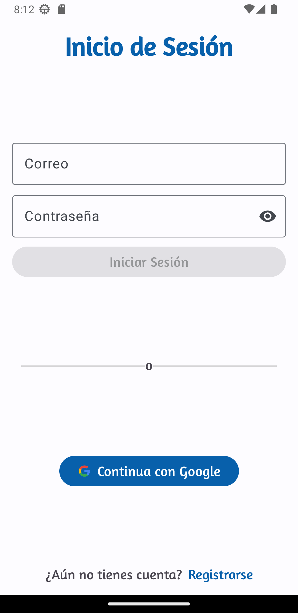
  

----

### 2. Home 
En la página de inicio, se muestra el entrenamiento diario seleccionado, el cual puede completarse y registrarse en el historial. La ventana de inicio puede estar vacía, esperando que se seleccione un entrenamiento diario. Para añadirlo, basta con pulsar en la pantalla. Si ya hay un entrenamiento seleccionado, se mostrarán dos botones: uno para iniciar el entrenamiento y otro para eliminarlo como entrenamiento diario.

En caso de que el usuario no tenga ningún entrenamiento creado, aparecerá un mensaje con la opción de hacer clic para crear uno. Si ya existen entrenamientos creados, se mostrarán todos los entrenamientos disponibles, siendo resaltado aquel que esté actualmente seleccionado.

Sin entrenamiento diario seleccionado                                                                    | Con entrenamiento diario seleccionado
:------------------------------------------------------------------------------------------------------: |:-----:
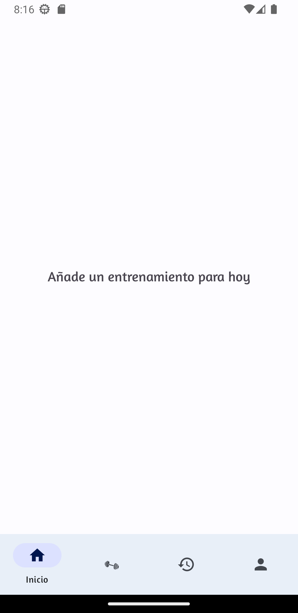                                            |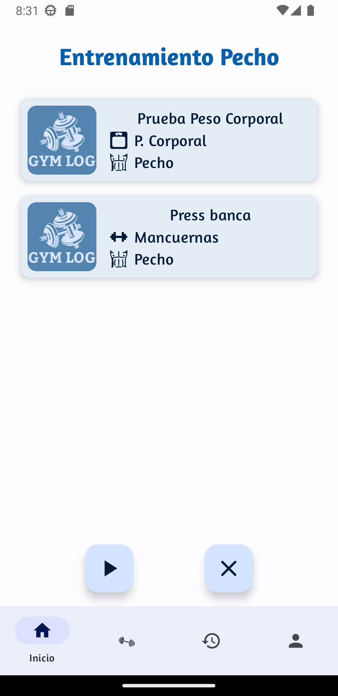
Sin entrenamientos                                                                                       | Con entrenamientos
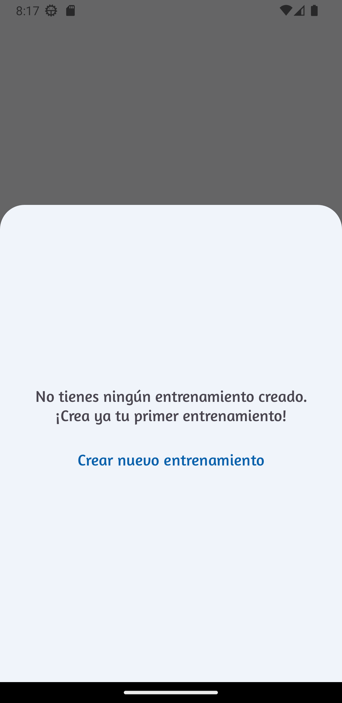 | 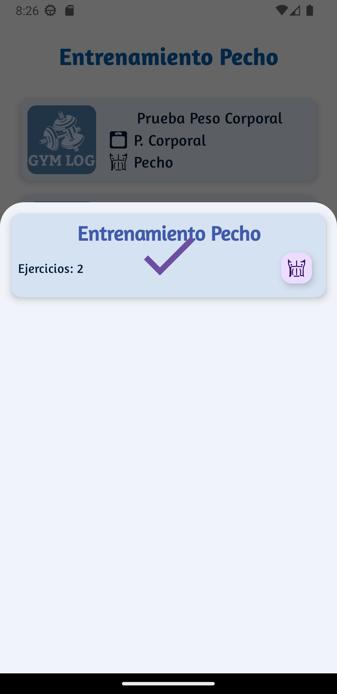

Si el usuario selecciona el botón con el icono *play*, se mostrará la siguiente secuencia de ventanas a medida que avanza:

1. **Ventana de selección de ejercicios del entrenamiento completados:** En esta ventana, se presentarán los ejercicios que forman parte del entrenamiento diario. El usuario podrá marcar como completados los ejercicios a medida que los realiza.

  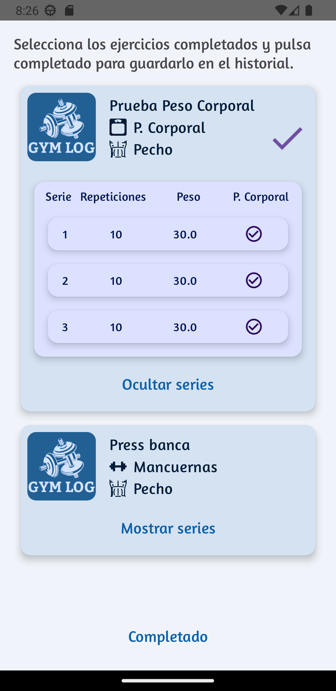

2. **Ventana de introducción de observaciones:** Una vez finalizados los ejercicios, se mostrará una ventana donde el usuario podrá ingresar observaciones adicionales relacionadas con el entrenamiento. Estas observaciones se almacenarán en el historial junto con los ejercicios completados.

 
  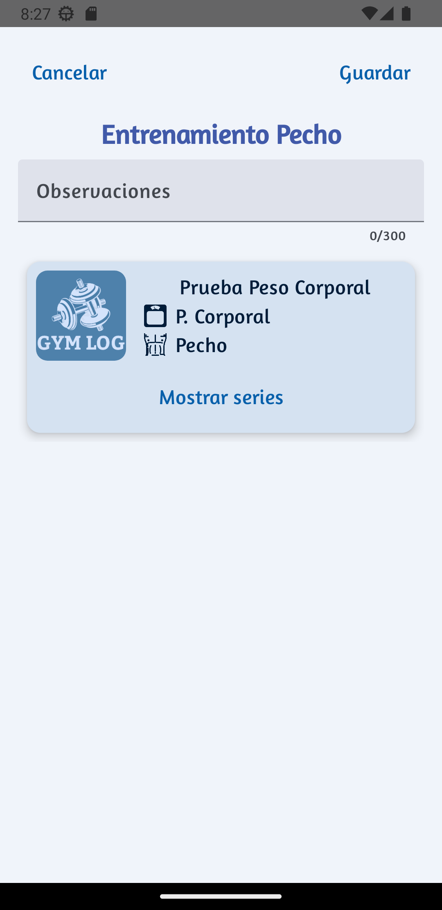

Una vez completado el proceso, el entrenamiento diario volverá a estar vacío, listo para seleccionar un nuevo entrenamiento. Además, se generará un nuevo registro en el historial que contendrá los ejercicios marcados como completados y las observaciones introducidas por el usuario.

----

### 3. Entrenamientos
En la ventana de "Entrenamientos", los usuarios verán una lista de los entrenamientos previamente creados, junto con un botón para crear nuevos entrenamientos.

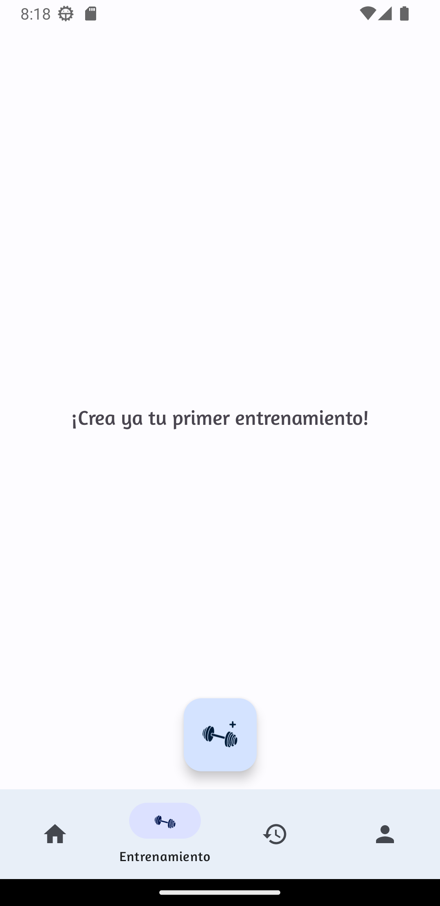

Al pulsar el botón de crear nuevos entrenamientos, los usuarios serán redirigidos al "Editor de Entrenamientos".

#### Editor de entrenamiento
En este editor, podrán introducir todos los datos necesarios para configurar un nuevo entrenamiento. Podrán agregar ejercicios, modificar las series, los pesos y realizar otras personalizaciones según sus necesidades.

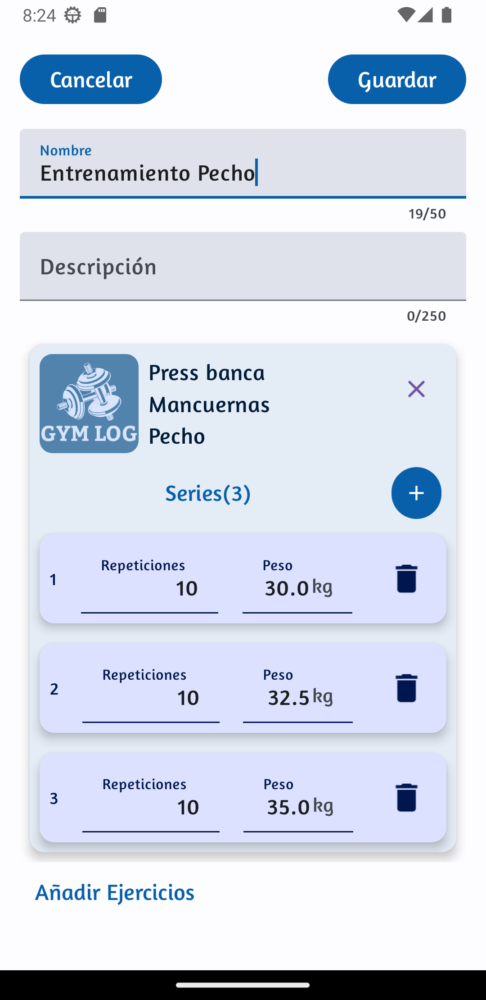

Al pulsar en "Añadir ejercicios" en el editor de entrenamientos, se abrirá la ventana de "Selección de ejercicios". En esta ventana, se mostrarán los ejercicios disponibles para que el usuario pueda seleccionar aquellos que desea añadir a su entrenamiento.

#### Selección de ejercicios
En esta se representan los ejercicios disponibles para que el usuario pueda seleccionarlos para su entrenamiento. En el caso de que el ejercicio que requiere el usuario no se encuentre en la lista de los ejercicos, el usuario podrá crear un nuevo ejercicio pulsando en "Crear ejercicio". Además, esta ventana cuenta con varios filtros, por nombre, grupo muscular involucrado, equipamento utilizado y por personalizados.

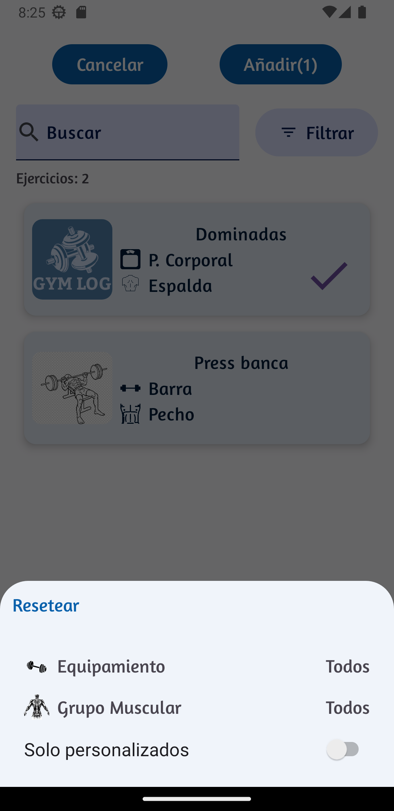 | 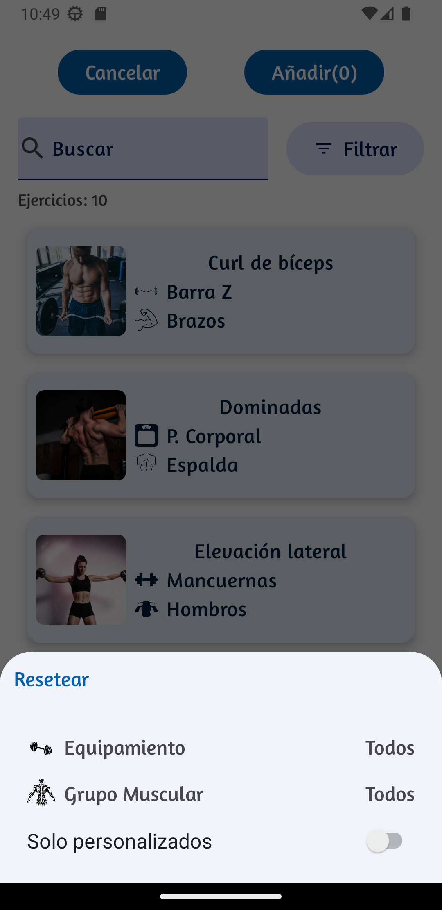
---------------------------------------------------------------------------------- | -----

#### Creación de ejercicios
En la creación de ejercicios, se podrán introducir todos los datos necesarios para la creación de un nuevo ejercicio.
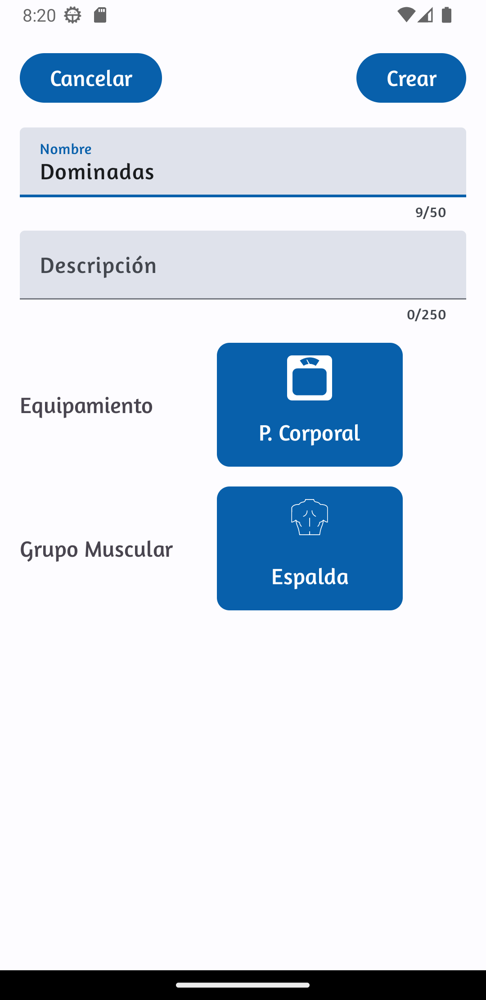

Selección de equipamiento                                                               | Selección de grupo muscular
:----------------------------------------------------------------------------------:    | :-----:
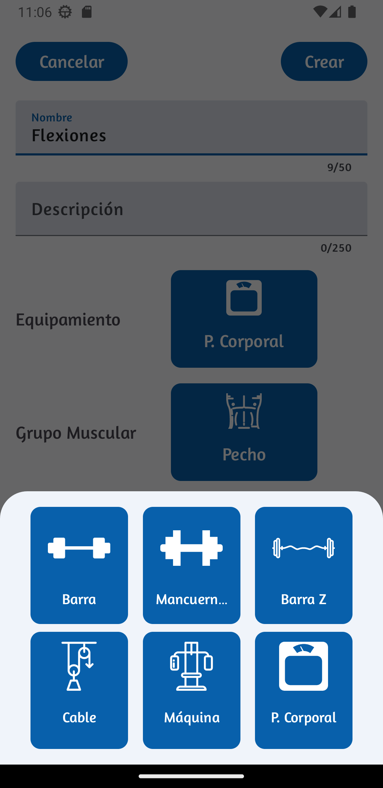  | 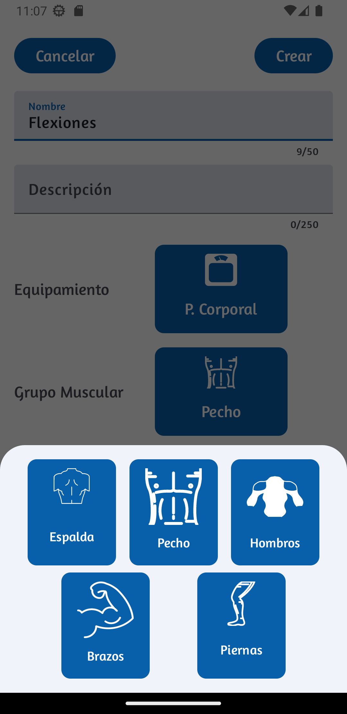

### 4. Historial
En la ventana del "Historial", encontrarás un registro de todos los entrenamientos completados. Estos estarán organizados en una lista ordenada del día más próximo hasta el más antiguo, y además podrás filtrarlos por día utilizando un calendario y seleccionando una fecha específica. También tendrás la opción de ver los detalles de cada uno de estos entrenamientos realizados.

Historial                                                                 | Detalles entrenamiento completado
:-----------------------------------------------------------------------: | :-----:
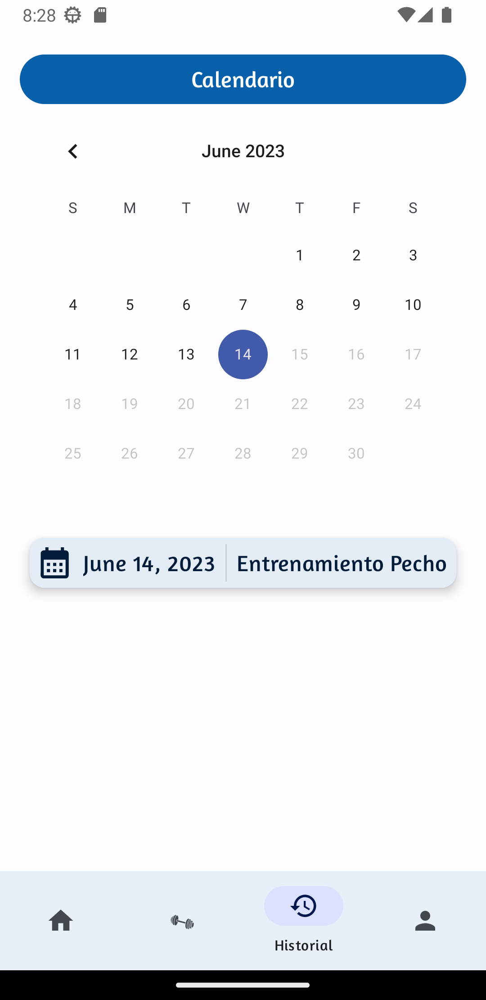  | 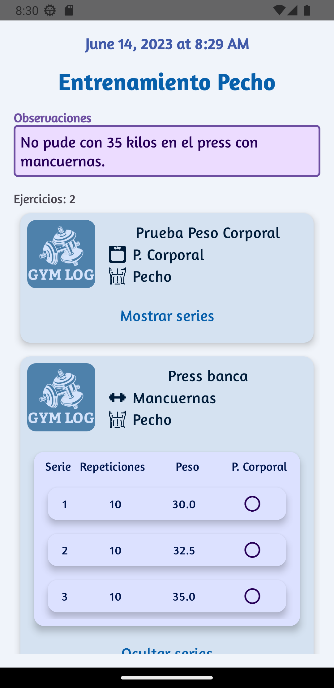

### 5. Usuario
En la ventana "Usuario" el usuario tendrá la capacidad de visualizar y ajustar los datos necesarios para facilitar la creación de entrenamientos. Esto incluye las repeticiones y series predeterminadas que se generarán al seleccionar un ejercicio durante la creación de un entrenamiento. También podrá especificar el peso del usuario para los ejercicios que involucren el peso corporal.
Además de esto, al hacer clic en el botón "Mis ejercicios", podrá ver los ejercicios que ha creado, así como crear nuevos ejercicios o eliminar los existentes según sea necesario.
-->

Ventana de usuario                                                   | Ejercicios usuario 
:------------------------------------------------------------------: | :-----:
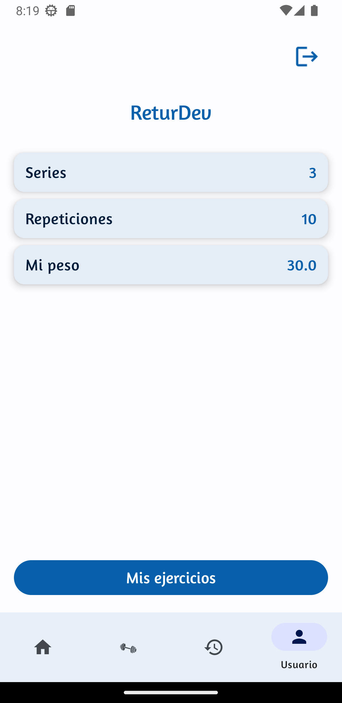 | 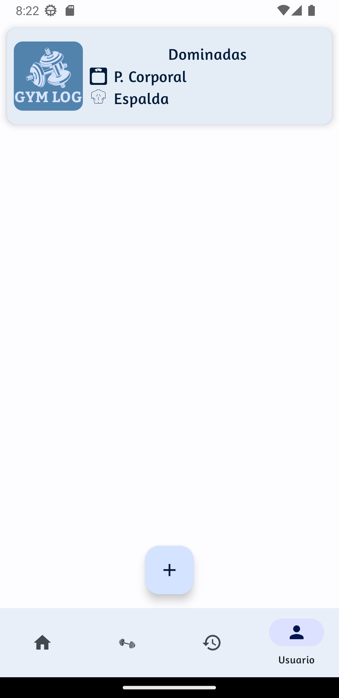 
