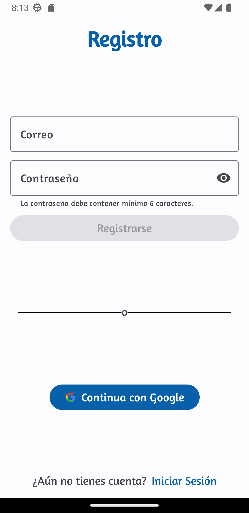
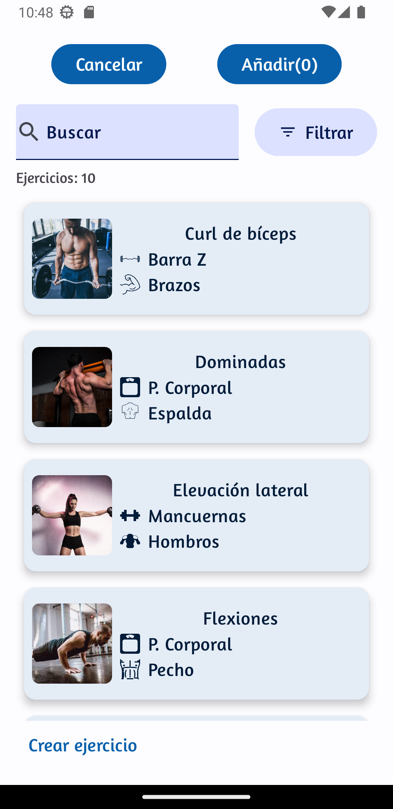

# :medal_sports: ¿Qué es GymLog? :medal_sports:
**GymLog** es una aplicación que te ayuda a llevar un registro detallado de tus entrenamientos en el gimnasio. Con esta aplicación, puedes crear planes de entrenamiento personalizados mediante una selección de ejercicios ya incluidos en la aplicación o incluso agregar tus propios ejercicios. Además, puedes establecer la cantidad de trabajo deseado para cada sesión y programar entrenamientos diarios.
Cada sesión completada se guardará automáticamente en un historial que puedes filtrar por fecha para hacer un seguimiento de tu progreso. 

### :iphone: Tecnologías utilizadas :iphone:
Esta aplicación se ha desarrollado utilizando **Android y Kotlin**, siguiendo una arquitectura **MVVM**. Además, se han utilizado los siguientes recursos para su creación:
+ Dagger Hilt
+ Glide
+ Firebase Authentication
+ Firestore
+ Material 3

## Funcionamiento
El primer paso para los usuarios es registrarse e iniciar sesión. Una vez iniciada la sesión con una cuenta, serán redirigidos a una ventana principal que contará con un menú inferior. A través de este menú, los usuarios podrán navegar por las secciones principales de la aplicación:
1. Home
2. Entrenamientos
3. Historial
4. Usuario

### 1. Inicio de sesión y registro 
Permite el registro y el inicio de sesión a través de correo y contraseña o mediante google.

  
  

----

### 2. Home 
En la página de inicio, se muestra el entrenamiento diario seleccionado, el cual puede completarse y registrarse en el historial. La ventana de inicio puede estar vacía, esperando que se seleccione un entrenamiento diario. Para añadirlo, basta con pulsar en la pantalla. Si ya hay un entrenamiento seleccionado, se mostrarán dos botones: uno para iniciar el entrenamiento y otro para eliminarlo como entrenamiento diario.

En caso de que el usuario no tenga ningún entrenamiento creado, aparecerá un mensaje con la opción de hacer clic para crear uno. Si ya existen entrenamientos creados, se mostrarán todos los entrenamientos disponibles, siendo resaltado aquel que esté actualmente seleccionado.

Sin entrenamiento diario seleccionado                         |Con entrenamiento diario seleccionado
:-----------------------------------------------------------: |:-----:
 |
Sin entrenamientos                                                                            | Con entrenamientos
 | 

Si el usuario selecciona el botón con el icono *play*, se mostrará la siguiente secuencia de ventanas a medida que avanza:

1. **Ventana de selección de ejercicios del entrenamiento completados:** En esta ventana, se presentarán los ejercicios que forman parte del entrenamiento diario. El usuario podrá marcar como completados los ejercicios a medida que los realiza.

  

2. **Ventana de introducción de observaciones:** Una vez finalizados los ejercicios, se mostrará una ventana donde el usuario podrá ingresar observaciones adicionales relacionadas con el entrenamiento. Estas observaciones se almacenarán en el historial junto con los ejercicios completados.

 
  

Una vez completado el proceso, el entrenamiento diario volverá a estar vacío, listo para seleccionar un nuevo entrenamiento. Además, se generará un nuevo registro en el historial que contendrá los ejercicios marcados como completados y las observaciones introducidas por el usuario.

----

### 3. Entrenamientos
En la ventana de "Entrenamientos", los usuarios verán una lista de los entrenamientos previamente creados, junto con un botón para crear nuevos entrenamientos.

Al pulsar el botón de crear nuevos entrenamientos, los usuarios serán redirigidos al "Editor de Entrenamientos".

#### Editor de entrenamiento
En este editor, podrán introducir todos los datos necesarios para configurar un nuevo entrenamiento. Podrán agregar ejercicios, modificar las series, los pesos y realizar otras personalizaciones según sus necesidades.

Al pulsar en "Añadir ejercicios" en el editor de entrenamientos, se abrirá la ventana de "Selección de ejercicios". En esta ventana, se mostrarán los ejercicios disponibles para que el usuario pueda seleccionar aquellos que desea añadir a su entrenamiento.

#### Selección de ejercicios
En esta se representan los ejercicios disponibles para que el usuario pueda seleccionarlos para su entrenamiento, además esta ventana cuenta con varios filtros, por nombre, grupo muscular involucrado, equipamento utilizado y por personalizados.

